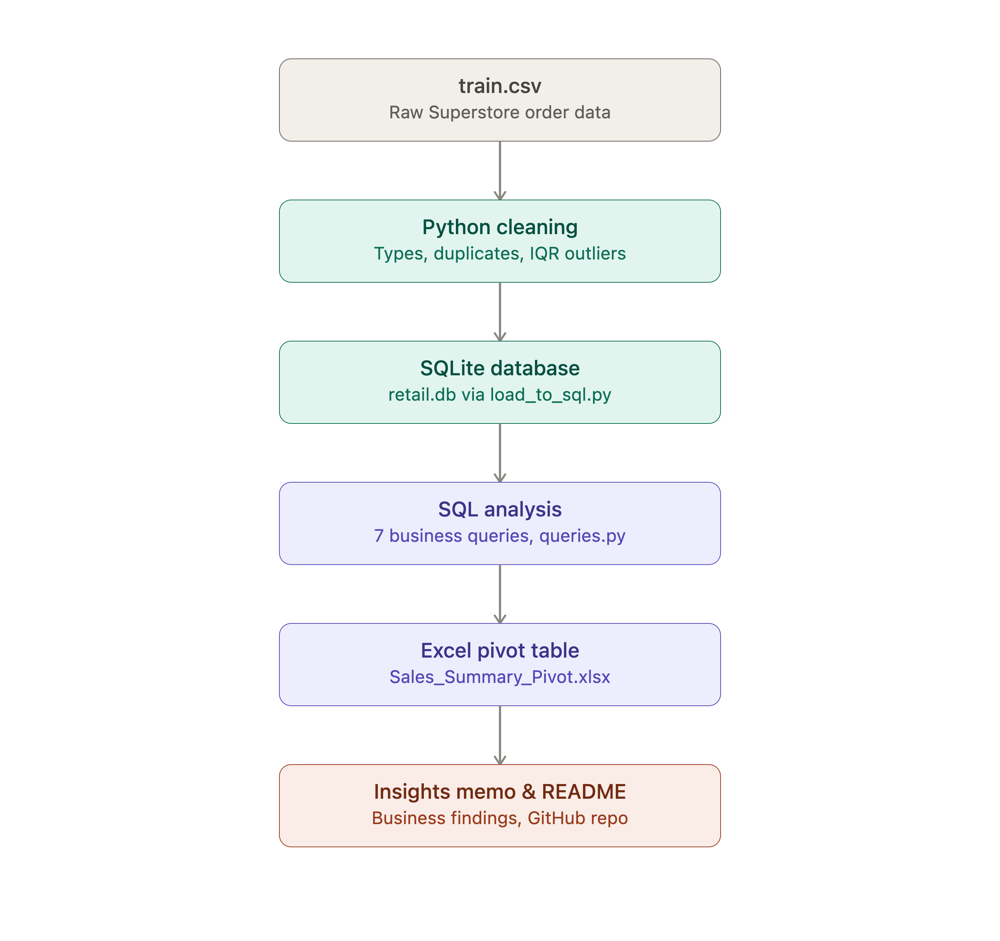

# Retail Sales Analytics — Python, SQL & Excel

## Problem Statement
Retail businesses often see revenue spikes during certain months but don't 
know whether those spikes come from higher-value orders or simply more orders. 
This project analyzes 4 years (2015–2018) of retail order data to uncover 
which categories, regions, and time periods drive revenue — and to separate 
volume-driven trends from value-driven ones.

## Data & Approach
## Project Architecture

- **Dataset**: Superstore retail orders (9,800 rows, 18 columns) — Order, 
  Customer, Product, Region, and Sales fields spanning 2015–2018.
- **Tools used**: Python (pandas) for cleaning, SQLite for querying, 
  Excel/Numbers for pivot analysis.
- **Steps**:
  1. Cleaned the dataset in Python — checked for missing values, duplicates, 
     converted date columns to datetime, and standardized types.
  2. Flagged statistical outliers in Sales using the IQR method.
  3. Loaded the cleaned data into a SQLite database.
  4. Wrote 7 original SQL queries to answer business questions (category/region 
     revenue, monthly trends, top customers, seasonality).
  5. Built a pivot table (Order Month × Category) to cross-check SQL results 
     and exported it to Excel.

## Key Insights
1. Technology, Furniture, and Office Supplies are closely matched in revenue 
   ($827K / $729K / $705K) — no single category dominates.
2. Phones and Chairs are the top two sub-categories by sales, together 
   outselling the next three sub-categories combined.
3. **Nov/Dec revenue spikes are volume-driven, not value-driven** — order 
   count nearly quadruples (297 → 1,449) between February and November, while 
   average order value stays roughly flat across the year.
4. West and East regions generate ~70% of total revenue; South lags at less 
   than half of West's total.
5. Revenue is concentrated among a small group of top customers, led by a 
   single customer spending $25K+.
6. ~11.7% of orders (1,145 rows) were flagged as statistical outliers in 
   Sales value, worth further investigation as bulk orders or data anomalies.

## Repository Contents
- `train.csv` — raw dataset
- `data_cleaning.py` — Python cleaning and outlier detection
- `load_to_sql.py` — loads cleaned data into SQLite
- `sql_analysis.py` — 7 original SQL analysis queries
- `Sales_Summary_Pivot.xlsx` — Excel pivot table (Order Month × Category)
- `outliers_flagged.csv` — flagged outlier rows
- `insights_memo.md` — 1-page business insights memo
- `retail_project_pipeline.png` — project workflow diagram

## What I'd Do Next
- Bring in a second dataset (e.g. marketing spend or ad calendar) to test 
  whether Nov/Dec order-count spikes correlate with promotional activity.
- Build a simple customer segmentation model to understand what separates 
  top-10 customers from the rest.
- Automate the pivot/Excel export step so the report refreshes on new data without manual rebuilding.